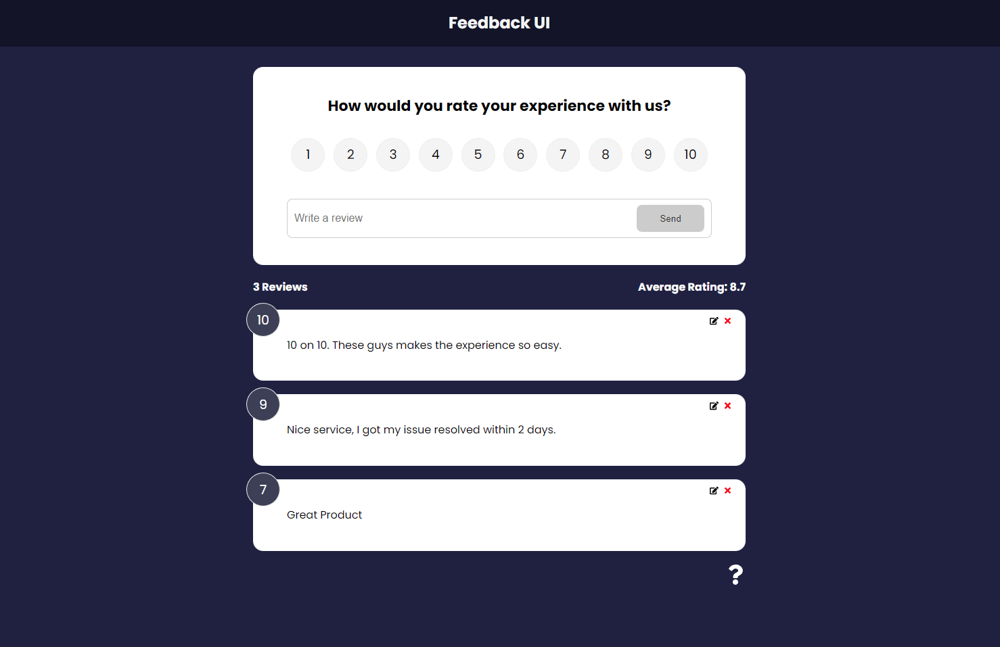

# Feedback UI

Feedback UI is a simple interface where users can sumbit Feedback for an application.

### Screen

### Tech Stack

- ReactJS
- Context API
- JSON Server

### To run the project

- Download the code
- Run `npm install` in the root.
- Run `npm run dev` to run it in your local machine.
- The frontend will run on `PORT 3000` by default and the JSON Server will run on `PORT 5000` by default.
- You can change the backend port by opening the `package.json` file and changing the proxy.

### Learnings

- Type checking for the props by using `Proptypes & Default Props`.
- Using `React Icons`.
- Creating custom `HTML Styled Components`. For example custom `CARD` component.
- `Navlink` to highlight the current page link in the navbar.
- Intoduction to animation using `Framer Motion`.
